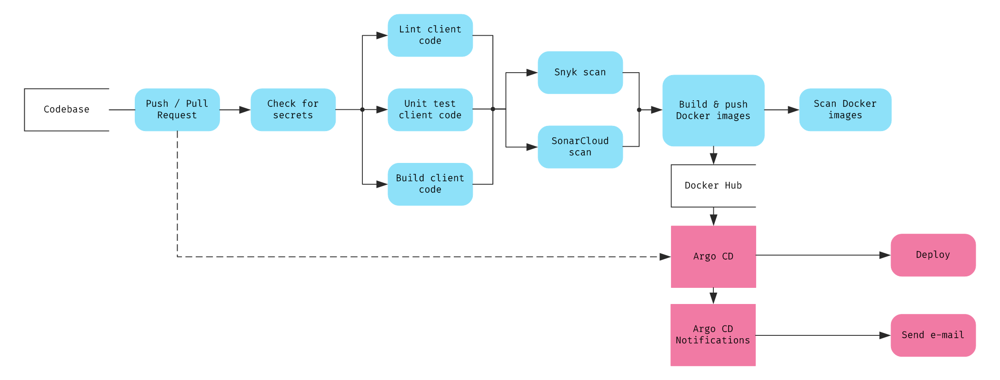

## Telerik Academy Upskill 11 DevOps Final Project

Bogomil Valev 

### Project Structure

The project consists of a simple web app, running a React front-end and an express server for back-end, mocking the responses from a json.

A push or a pull request trigger the pipeline, which checks for secrets, lints, tests, and scans the code for vulnerabilities and code smells. It then builds and pushes images to [Docker Hub](https://hub.docker.com/repository/docker/bvalev), and then checks them for vulnerabilities.

We have Argo CD running locally together with Argo CD Notifications. It syncs with the repo and deploys our app, sending status notifications to our email.

### Run the Project

We assume that we have Argo CD [set up and running locally](#project-setup).
```
kubectl apply -n argocd -f application.yaml
```

### Pipeline Diagram



### Project Setup

We assume that we have Kubernetes running and the ```kubectl``` command is available.

#### Argo CD

1. Install Argo CD

```
kubectl create namespace argocd
kubectl apply -n argocd -f https://raw.githubusercontent.com/argoproj/argo-cd/stable/manifests/install.yaml
```

2. Install the [Argo CD CLI](https://github.com/argoproj/argo-cd/releases/latest)

3. Set up the API server using port forwarding

```
kubectl port-forward svc/argocd-server -n argocd 8080:443
```

It can then be accessed at [localhost:8080](https://localhost:8080)

4. Update the admin password

Get the current password
```
kubectl -n argocd get secret argocd-initial-admin-secret -o jsonpath="{.data.password}" | base64 -d; echo
```

Login to the API server
```
argocd login localhost:8080
```

Update the password
```
argocd account update-password
```

#### Argo CD Notifications

We're using the [Default Triggers](https://argocd-notifications.readthedocs.io/en/stable/triggers/#default-triggers) setup. In order for it to work, we've included the following field in ```application.yaml```:
```
metadata.annotations:
    notifications.argoproj.io/subscribe.on-sync-succeeded.gmail: argocdtest68a90dd@gmail.com
```

1. Install Argo CD Notifications

```
kubectl apply -n argocd -f https://raw.githubusercontent.com/argoproj-labs/argocd-notifications/release-1.0/manifests/install.yaml
```

2. Install Triggers and Templates from the catalog

```
kubectl apply -n argocd -f https://raw.githubusercontent.com/argoproj-labs/argocd-notifications/release-1.0/catalog/install.yaml
```

3. Add Email username and password token to ```argocd-notifications-secret``` secret

```shell
export EMAIL_USER=<your username>
export PASSWORD=<your password>
kubectl apply -n argocd -f - << EOF
apiVersion: v1
kind: Secret
metadata:
  name: argocd-notifications-secret
stringData:
  email-username: $EMAIL_USER
  email-password: $PASSWORD
type: Opaque
EOF
```

*Note: if using gmail, you must generate an [app password](https://support.google.com/mail/answer/185833?hl=en).*

4. Register Email notification service

```
kubectl -n argocd patch cm argocd-notifications-cm --patch-file argocd-notifications-cm.yaml
```

### Further Improvements

Some further improvements that were considered during the work on this project include:


- Implement monitoring

- Optimize Docker images

- Set up Argo Rollouts

- Set up Sonar Quality Gate

- Utilize pre-push scrips with Husky

- Integrate SonarCloud into the codebase

- Extract more variables into ConfigMaps and Secrets

### References

[Kubernetes Declarative Config](https://kubernetes.io/docs/tasks/manage-kubernetes-objects/declarative-config/)

[Argo CD Getting Started](https://argo-cd.readthedocs.io/en/stable/getting_started) 

[Argo CD Declarative Setup](https://argo-cd.readthedocs.io/en/stable/operator-manual/declarative-setup) 

[Argo CD Notifications](https://argocd-notifications.readthedocs.io/en/stable/) 
